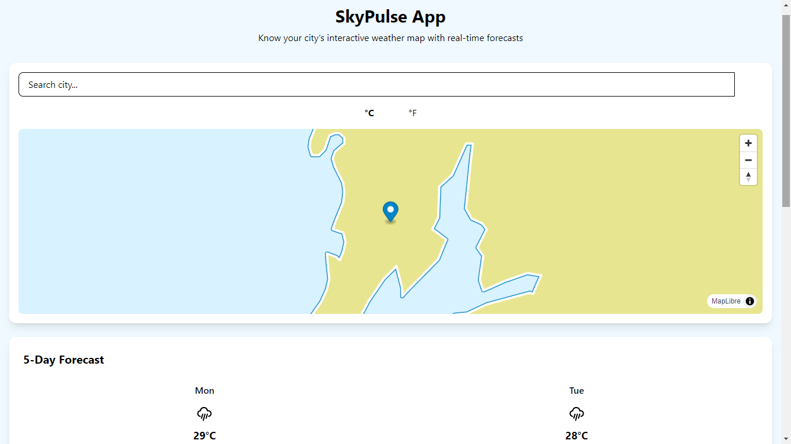
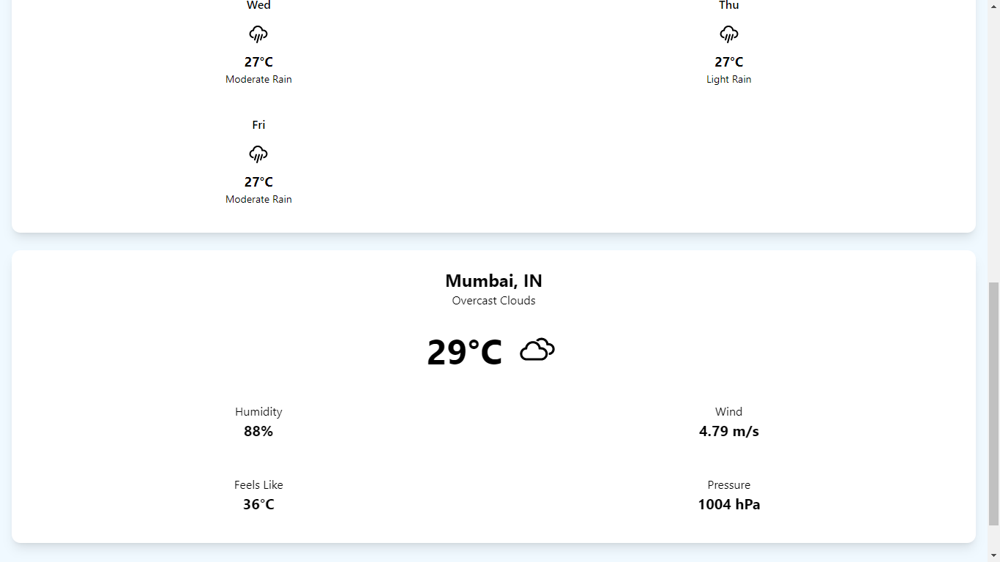

# 🌤️ SkyPulse - Interactive Weather Dashboard

 
 

A modern weather application providing real-time forecasts with interactive maps. Built with React, Vite, and Tailwind CSS.

## ✨ Features

- 🌍 Location-based weather data
- 📊 5-day weather forecast
- 🗺️ Interactive map for location selection
- 🌡️ Celsius/Fahrenheit toggle
- 📱 Fully responsive design
- 🚀 Fast API integration with OpenWeatherMap

## 🛠️ Technologies Used

- **Frontend**: React 18 + Vite
- **Styling**: Tailwind CSS
- **Maps**: MapLibre GL JS
- **Icons**: React Icons (Weather Icons)
- **API**: OpenWeatherMap

## 🚀 Getting Started

### Prerequisites
- Node.js (v16 or higher)
- npm (v8 or higher)
- OpenWeatherMap API key

### Installation
1. Clone the repository:
   ```bash
   git clone https://github.com/prasad-dhole/skypulse-app.git
   cd skypulse-app


2. Install Dependencies : 
   ```bash
   npm install

3. Create .env file:  Inside .env -->
   ```bash
   VITE_OPENWEATHER_API_KEY=your_api_key_here

4. Start the development server : 
   ```bash
   npm run dev


### 📂 Project Structure

skypulse-app/

├── src/

│   ├── components/       # Reusable components

│   ├── hooks/            # Custom React hooks

│   ├── utils/            # Utility functions

│   ├── App.jsx           # Main application

│   └── main.jsx          # Entry point

├── public/               # Static assets

└── vite.config.js        # Vite configuration


### 🌐 API Integration

The app uses:

OpenWeatherMap Current Weather API

OpenWeatherMap 5-Day Forecast API

OpenWeatherMap Geocoding API


### 🙏 Acknowledgments

OpenWeatherMap for their excellent weather API

MapLibre for open-source mapping

Vite team for the amazing build tool
